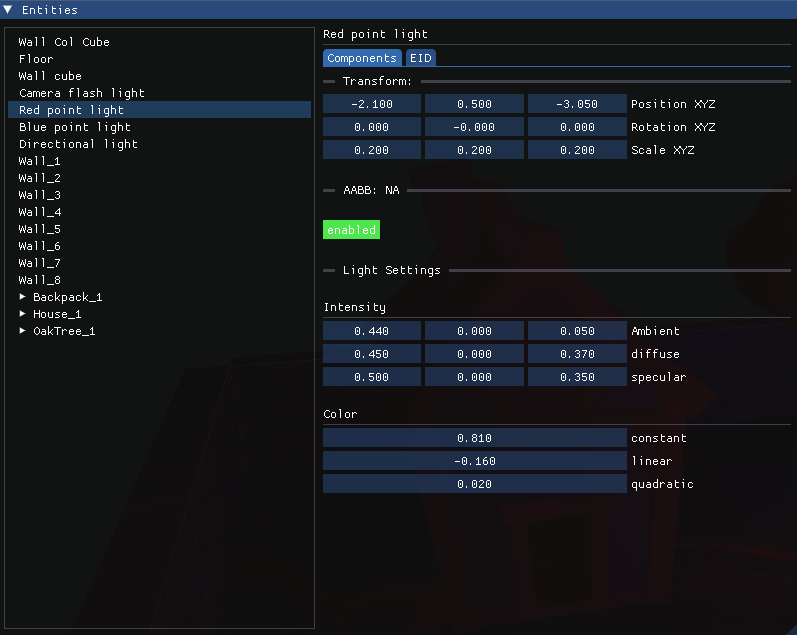


Implementing Boids.


## What are Boids?

Boids (short for "bird-oid objects") are "an artificial life program, developed by Craig Reynolds in 1986, which simulates the flocking behaviour of birds, and related group motion." [<a href="#ref1">1</a>\].

[ In Development ]

## References
1. <a id="ref1"> Boids Wikipedia Page. [Online]. Available: https://en.wikipedia.org/wiki/Boids. [Accessed: July. 6, 2025].</a>
2. <a id="ref2"> Cambridge Computer Science Talks, 2021 "Forward and Deferred Rendering," Online video clip, YouTube, Available: <https://www.youtube.com/watch?v=n5OiqJP2f7w\>. [Accessed on: Apr. 26, 2024].</a>
3. <a id="ref3"> Wikipedia, "Deferred shading," Wikipedia: The Free Encyclopedia. Available: https://en.wikipedia.org/wiki/Deferred_shading. [Accessed: Sep. 6, 2024].</a>
4. "What are the advantages and disadvantages of using deferred rendering?" LinkedIn. [Online]. Available: https://www.linkedin.com/advice/1/what-advantages-disadvantages-using-deferred-rendering#:~:text=Deferred%20rendering%20has%20its%20drawbacks,being%20compatible%20with%20some%20platforms. [Accessed: Sep. 6, 2024].</a>