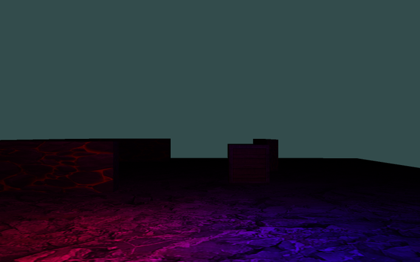
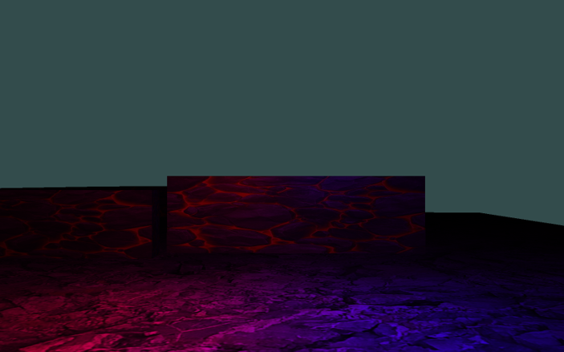
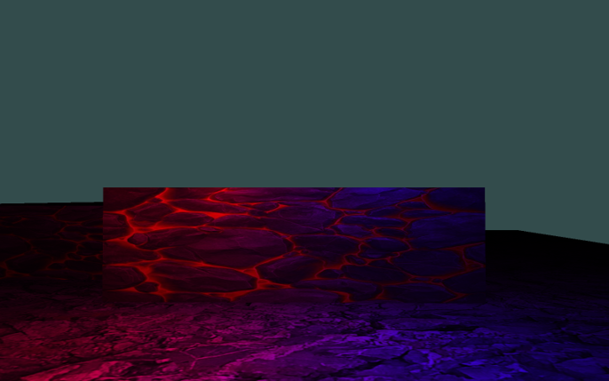
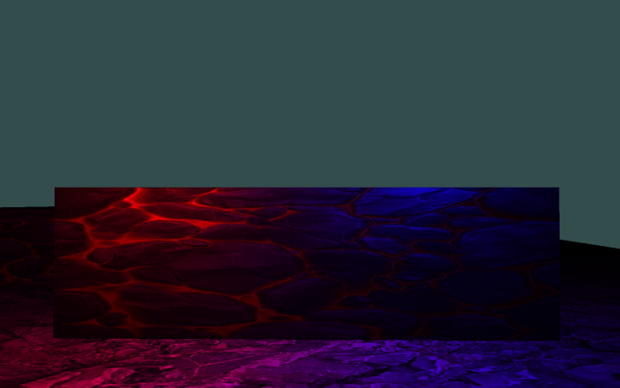
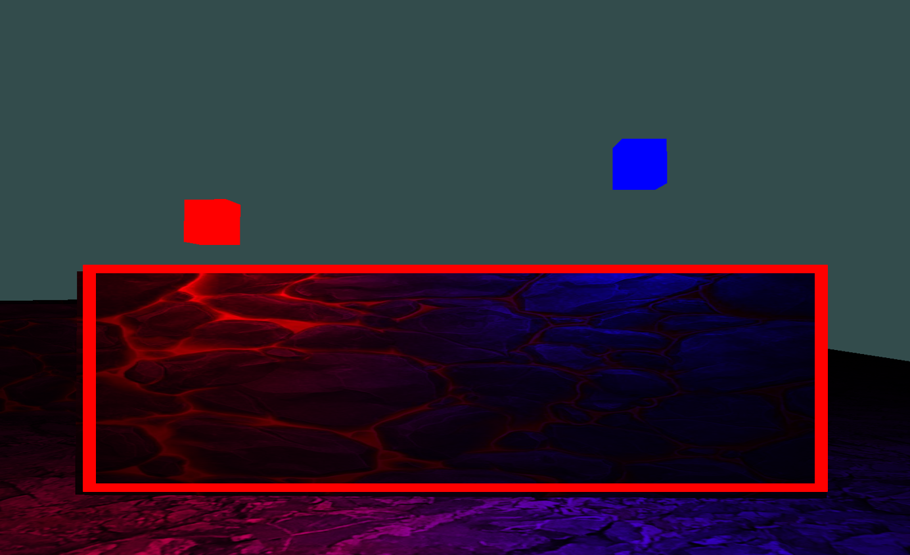


An overview of the two main types of rendering commonly used in computer graphics


## Two types of rendering

Anyone who's even done the briefest of experiments with a graphics API will likely be familiar with forward rendering. It is (for lack of a better term) the "default" form of rendering.  
In forward shading, each draw call is tied to the lighting calculations.

Conversely, deferred shading splits the rendering process into two rendering passes:
- A geometry Pass (Which renders all geometry without doing any lighting calculations)
- Lighting pass, (which iterates over each pixel in the final image to perform lighting calculations)

 
Hence the name "deferred shading," we defer all lighting calculations to a later stage.
 

## Forward Shading
Forward shading is simply rendering all geometry and all it's lighting data alongside each draw call.  
The benifits being it's simplicty and ability to handle transparancy and anti aliasing far more easily than deferred shading.
  
However, a major flaw in default deferred shading is the issue of **Overdraw**. 
This occurs when you draw new fragments to your frames final output image over the top of existing fragments that were shaded in a previous draw call.  

For example, lets say you want to render this scene below using forward rendering:

You would first clear the framebuffer, then issue your first draw call to draw the floor and background geometry:

Then perhaps a second draw call for this geometry

A third draw call for this geometry

and finally a fourth draw call for the final piece of geometry:

In this case, a large portion of the fragments from the first draw call, and all of the fragments from the second and third draw call were overdrawn.

Remember that since we are performing forward shading, we do all the lighting calculations for each fragment per draw call.
As such, for the fragments within the red rectangle in the image below, we have 3x the number of lighting calculations we needed to perform for the final image.

Thankfully, all hope is not lost and we aren't forever doomed to inefficient overdraw in forward shading.
One such solution is to use **deferred shading**.

## Deferred Shading
Deferred shading works thanks to something called the **G-Buffer**. In the geometry pass, each fragment shader invocation, instead of doing lighting calculations, sends all data about each fragment (that will later be required to calculate the lighting) to the **G-Buffer**.
 
The **G-Buffer** is actually a collection of buffers, such as one for each fragments depth value, surface normals, color values, etc. 

To be continued...

## Tests
Testing reference to unity documentation on Forward Rendering [<a href="#ref1">1</a>\].
Testing reference to youtube video [<a href="#ref2">2</a>\].

## References
1. <a id="ref1"> Unity Technologies, "Forward rendering," Unity Documentation, 2023. [Online]. Available: https://docs.unity3d.com/Manual/RenderTech-ForwardRendering.html. [Accessed: Apr. 22, 2024].</a>
2. <a id="ref2"> Cambridge Computer Science Talks, 2023 "Forward and Deferred Rendering," Online video clip, YouTube, Available: <https://www.youtube.com/watch?v=n5OiqJP2f7w\>. [Accessed on: Apr. 26, 2024].</a>

