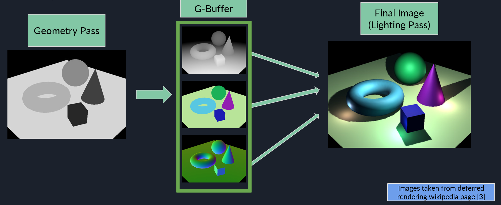


An overview of the two main types of rendering commonly used in computer graphics


## Two types of rendering

Anyone who's done the briefest of experiments with a graphics API will likely be familiar with the idea behind forward rendering, even if the term is unfamiliar. It is (for lack of a better term) the "default" form of rendering.  
In forward shading, lighting calculations (or shaders to be more specific) are tied to each individual draw call. Each draw renders the geometry and does all the texture sampling, lighting calculations and final colour calculations for the drawn fragments all in one pass. 

Conversely, deferred shading splits the rendering process into two rendering passes:
- A geometry Pass (Which renders all geometry without doing any lighting calculations)
- Lighting pass, (which iterates over each pixel in the final image to perform lighting calculations)

 
Hence the name "deferred shading," we defer all lighting calculations to a later stage.
 
Let's go into more detail for each:
 

## Forward Shading
Forward shading is simply rendering all geometry and all it's lighting data alongside each draw call.  
The benefits come in its simplicity and ease of handling transparency and anti-aliasing when compared with deferred shading.
  
However, a major flaw in default forward shading is the issue of **Overdraw**. 
This occurs when you draw new fragments to your frame's final output image over the top of existing fragments that were shaded in a previous draw call.  

For example, let's say you want to render this scene below using forward rendering:

You would first clear the framebuffer, then issue your first draw call to draw the floor and background geometry:

Then perhaps a second draw call for this geometry

A third draw call for this geometry

and finally, a fourth draw call for the final piece of geometry:

In this case, a large portion of the fragments from the first draw call, and all of the fragments from the second and third draw call were overdrawn.

Remember that since we are performing forward shading, we do all the lighting calculations for each fragment per draw call.
As such, for the fragments within the red rectangle in the image below, we have roughly 3x the number of lighting calculations we needed to perform for the final image.
 
Ideally, we would only do expensive lighting calculations for geometry that will be visible in the final image.

Thankfully, all hope is not lost and we aren't forever doomed to inefficient overdraw in forward shading.
One such solution is to use **deferred shading**.

## Deferred Shading
Deferred shading works thanks to something called the **G-Buffer**. In the **geometry pass** (the first of two render passes), each fragment shader invocation, instead of doing lighting calculations, sends all data about each fragment (that will later be required to calculate the lighting) to the **G-Buffer**.
 
The **G-Buffer** is actually a collection of buffers, e.g. one for each fragment's depth value, surface normals, color values, etc. 

If an object is drawn in front of another, its related G-Buffer data is overwritten with the new geometry data closer to the camera. 

After all draw calls in the **Geometry Pass** have been completed, our G-Buffer represents the data of every visible fragment. Fragments that were obscured behind geometry are not represented.

 

Next we move on to the **lighting pass**.
In the lighting pass, we render a full screen quad with texture coordianted to render the G-Buffer given to each vertex.

By doing this, each fragment that makes up the quad will receive interpolated texture coordinates that act as a sample point into the G-Buffer.

Since our screen quad's fragment layout is equivalent to the pixel data layout stored in our G-buffer, each fragment can use its UV coordinates to sample from the G-buffer and retrieve the data required to do lighting calculations at that point. 

For example, if we were just doing basic Lambertian diffuse shading, the G-Buffer could contain the point's position in world space and its surface normal. Then as long as our shader knows the position of the light sources in our scene, we can use this information to calculate the diffuse lighting for that fragment. 

By "Deferring" all expensive lighting calculations to the **lighting pass** we at most only do expensive lighting calculations for every pixel on the screen. Which in complex scenes with lots of overlapping geometry can drastically reduce the number of lighting calculations we need to perform.

These example images below from the Wikipedia page on deferred shading is an excellent example [<a href="#ref3">3</a>\]

You can see how during the geometry pass we render the geometry without any lighting ans store depth, color, normals, etc. in the G-buffer.
Then during the lighting pass the lighting is calculated. 

As useful as this rendering technique is, there are a few **downsides** [<a href="#ref2">2</a>\][<a href="#ref4">4</a>\]:
- Traditional Anti-aliasing techniques no longer work
- Unable to use traditional alpha blending methods for transparent objects.
- Increased memory bandwidth needed to manage a large G-buffer, which becomes more troublesome as resolutions increase, proportionally increasing the size of the G-buffer.

## Related Topics
Deferred shading was mainly created as a means of increasing the number of lights that could be in a scene while maintaining reasonable real-time performance metrics. [<a href="#ref3">3</a>\]
This technique was later built upon using [Tiled Shading](../tiledshading).

## References
1. <a id="ref1"> Unity Technologies, "Forward rendering," Unity Documentation, 2023. [Online]. Available: https://docs.unity3d.com/Manual/RenderTech-ForwardRendering.html. [Accessed: Apr. 22, 2024].</a>
2. <a id="ref2"> Cambridge Computer Science Talks, 2021 "Forward and Deferred Rendering," Online video clip, YouTube, Available: <https://www.youtube.com/watch?v=n5OiqJP2f7w\>. [Accessed on: Apr. 26, 2024].</a>
3. <a id="ref3"> Wikipedia, "Deferred shading," Wikipedia: The Free Encyclopedia. Available: https://en.wikipedia.org/wiki/Deferred_shading. [Accessed: Sep. 6, 2024].</a>
4. "What are the advantages and disadvantages of using deferred rendering?" LinkedIn. [Online]. Available: https://www.linkedin.com/advice/1/what-advantages-disadvantages-using-deferred-rendering#:~:text=Deferred%20rendering%20has%20its%20drawbacks,being%20compatible%20with%20some%20platforms. [Accessed: Sep. 6, 2024].</a>

