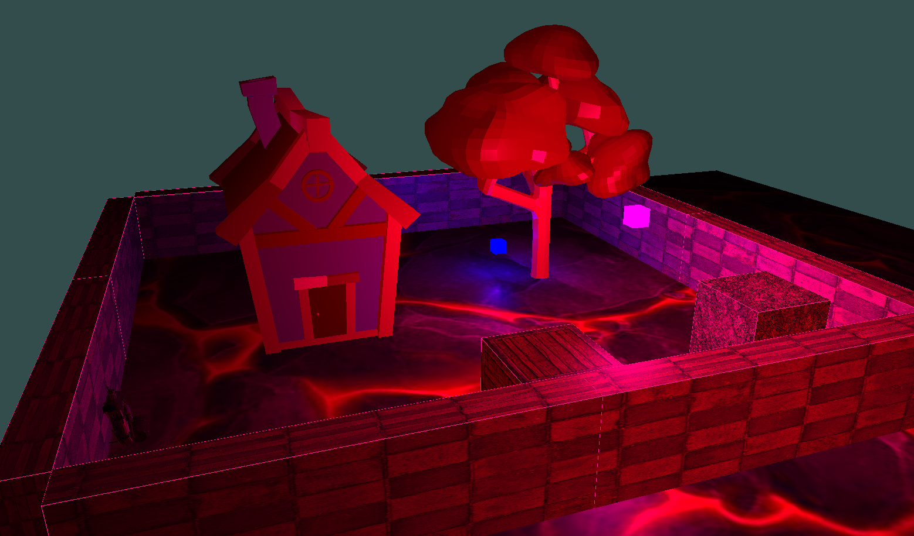
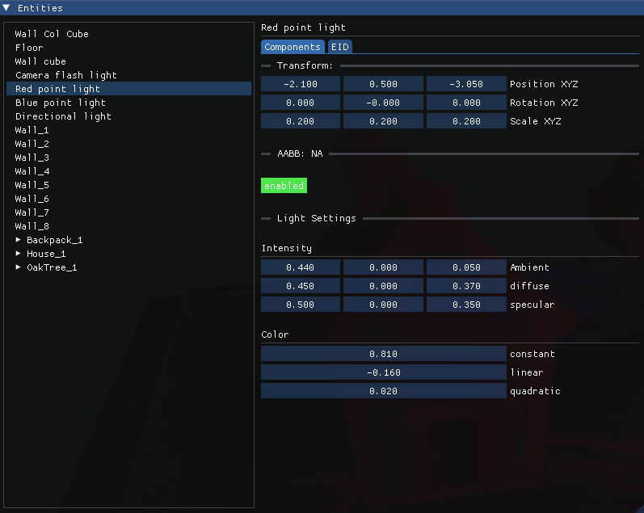


Small Scale Game Engine created using OpenGl and C++


## Basis For
This C++ OpenGl framework / small scale games engine I made was used to create the [Procedural Wold Using Perlin Noise Project](../proceduralworldpn/).

As such, I highly recommend viewing that page which also contains a link to the project github.

## Demo Video

This video showcases a number of this projects features. Feel free to jump through this video to specific time stamps.
The most notable features are the entity component system, such as being able to modify entities and their components via the GUI, alongside the lighting and shadow system. 



## Sample Scene

Image of the GUI that can be used to manipulate entities in the scene.

