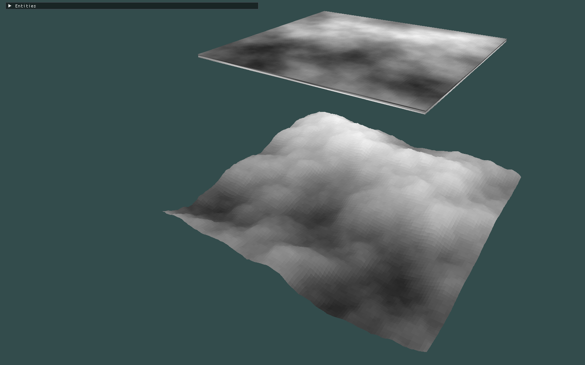
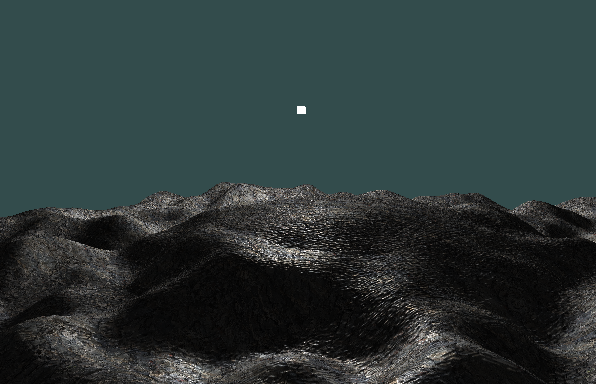




A basic heightfield implementation in OpenGL


## Introduction
A Height Field is simple and fun way to create some really nice looking terrain in a virtual enviornment. It has some limitations (such as the inability to create caves and overhangs), but otherwise, is a fantastic introductory terrain generation system that requires only basic graphics programming knowledge to implement.

The basic Idea is to generate the data for a plane mesh made up of a grid of nodes (evenly spaced apart), for each node, we sample from a height field texture to determine it's Y value.
The height field texture itself is just a top down grey scale image of a landscape in which darker shades of grey indicate lower elevation and lighter shades of grey indicate higher elevation.

A really easy way to understand it is with this image below:



The top mesh is simply rendering the height field texture to a flat quad, the mesh below it is also rendering the same texture to a flat plane, but the vertices making up the plane mesh have their ***y*** values adjusted (up or down) depending on the shade of grey on the textures corresponding texel.
If it's still unclear, don't worry, I'll go into more depth in upcoming explanation

## Rendering a Height Field
The rendering process is quite intuitive once you understand the basic idea, but there are some minor difficulties that can cause a slight headache if not handled properly

## 1. Creating a Height Field Mesh

To create a height field we first want to define a plane mesh with nodes and edges laid out in an evenly spaced x and z space grid.

The image below gives an example:



This image represents a top down view of the mesh, no matter what height field data we end up using, the ***x*** and ***z*** components of the nodes in this mesh will remain the same. The height field will only effect the ***y*** component of each node's position data.
<br>



Using OpenGL, we want to create a VBO of vertex data to represent a mesh similar to the one shown above. 
A simple way to do this is to calculate the number of nodes, based on the number of texels in the height field texture, then create an array of that size to hold to the data. 
We can set the distance/height between each node (the x and z offset) to any small value we like, but for each node we need to sample the corresponding color from the height field texture and use that to determine the ***y*** value.

But first we need to obtain an image to use as a height field, and then find out how to sample from it.

## 2. How to obtain a Height Field Texture

There are multiple ways to obtain a height field texture. The simplest method is using google images and searching for "height field textures" and grab one of the available images (ensure you are legally allowed to use it first of course).
<br><br>
Alternatively you can visit [this site](https://tangrams.github.io/heightmapper/) which provides satellite images of the world in height field format. Go to any location you like (e.g. Mt Fuji in Japan, the Andes in South America) and you can generate a height field of that location.
<br><br>
You can also create your own by hand using most image editing tools (such as Photoshop, GIMP, Krita, etc.) or even specialized software like Terragen.
<br><br>
An even more interesting option is to procedurally generate our own height field texture using pseudo random noise such as Perlin or Simplex noise. If you are just starting out though, I recommend first using a pre-existing texture from one of the above options, as the setup for generating Perlin noise in your own code can be fairly tedious depending on the software tools you are using.
If you are interested however, I have my own project page where I go into detail about [generating a simple small scale procedural world using Perlin noise](../procedural-world-pn).
<br><br>
However, If you really want to use a noise texture for your height map, and don't care care about dynamically adjusting the values during program runtime, tools like Photoshop and GIMP have their own noise generation functions. You could use one of these tools to generate your texture file, export it as an image (I chose PNG for simplicity), and use it for our height field generation code.

For this example however, we will stick with a pre-made height field. For this example, I used this one that I found online (feel free to also use it, but note that **it does not belong to me**, so if this is being used beyond a personal learning project, I advise generating your own or finding a royalty free texture):




## 3. Calculating mesh Surface normals

We're close to actually creating our vertex data for our height map, but before we do so, I need to discuss an important requirement if we want to implement Phong shading (or almost any kind of traditional shading technique).
<br><br>
In order to implement Phong shading, our mesh needs to have surface normals. (these are just unit vectors that are perpendicular to the surface at any particular point on the mesh). 
We will need to to calculate the light intensity at each point on the mesh, so unless we want flat shading, we need surface normals for our height field mesh.
<br><br>
I'm bringing this up now, as there are multiple ways of calculating the surface normals, and multiple points in our code were we can do so. Deciding on the best approach now will save us the headache of attempting to retroactively add it later.
<br><br>
At the risk of oversimplifying things, there are two points we would ideally chose to calculate the surface normals?
<br>
**Option 1** - Calculate them on the CPU before our render loop begins. and then store the surface normal data alongside the vertex position and texture coordinate data in our VBO. Then we simply sample the surface normal data in our shader code from the vertex data inputs.
<br>
**Option 2** - Calculate the them every frame in the shader code.
<br><br>
Both options have their pros and cons, **option 1** front loads the calculation at startup, but is highly efficient during runtime, as our GPU only needs to sample the pre calculated normals each frame. The downside being that our height field mesh geometry must remain static and can't change (unless we reconfigure the vertex buffer data between frames which is computationally expensive and inefficient).
**option 2** is more computationally expensive than option 1, but means that our geometry can easily be modified between frames and the normals will accurately represent the new modified geometries layout.
<br><br>
For this basic example I see no need to have our height field mesh vertex data change between frames. As such option 1 is a more preferable solution (in terms of efficiency).

## 4. How the Texture is sampled




graph LR;
A[Set Width and Height]-->B[Iterrate over HF];
B-->C[Generate VBO]


The following is a simple code example to calculate the vertex position and texture coordinate data for the height field mesh:
<br><br>
First we define a C++ Structure to hold the vertex data (I use [stb_image](https://github.com/nothings/stb) lib to load the texture data into an unsigned char* and the [glm](https://github.com/g-truc/glm) lib for vec3 and vec2 data types):

```cpp
#include "vendor/stb_image/stb_image.h"
#include <glm/glm.hpp>

struct Vert
{
	// Local Position
	glm::vec3 pos;

    // Surface Normal
	glm::vec3 norm;

	// TexCoords
	glm::vec2 texCord;

};
```
<br>
With our "Vert" data structure for storing vertex data defined, we can create an array (std::vector in this case) of Vert data types and fill it with the data we will later send to the VBO:

In this example, we will create as many vertices as pixels/texels in out height field texture. (therefore, if you use the code below without modification, I recommend you use a low resolution height field).
If you don't want one vertex per height field pixel, modify how the for loop iterates over the data. (e.g. if it increments by two instead of one for x and z, it will have 1/4 of the pixels, assuming your texture has equal width and height)

```cpp
int hmWidth;
int hmHeight;
int hmNrChannels;

// Create the array (std::vector of Vert data types)
std::vector<Vert> hmVerts;

// Load in the texture data using the stb_image lib
unsigned char* hmTexData = stbi_load("res/textures/heightmap.png", &hmWidth, &hmHeight, &hmNrChannels, 0);

//Check if the data was loaded in correctly
if (!hmTexData)
{
	std::cout << "\n --- Failed to load texture --- \n";
	ASSERT(false);
}

// Scale values used later to adjust the final height value of each vertex.
float yScale = 64.0f / 256.0f; 
float yShift = 16.0f;

// Values to multiply by the tex_coord values to have the texture we apply to repeat 6 times across the mesh surface.
// Chaneg the "6" below to change the number of times it repeats.
float x_texPoint = 1.0f / (hmWidth/6);
float y_texPoint = 1.0f / (hmHeight/6);

//Generate Height Field data (in this case, each vertex corresponds to a texel/pixel from the height map texture: hmTexData)
for(unsigned int z = 0; z < hmHeight; z++)
{
	for(unsigned int x = 0; x < hmWidth; x++)
	{
		Vert vert;
		unsigned char* texel = hmTexData + (x + hmWidth * z) * hmNrChannels;

        //Intensity of the height map texture at this texel. This is essentially out height value!
        //(Remember: white => Heigher, Dark => Lower)
		unsigned char y = texel[0];

		glm::vec3 vec;
		vec.x = x;

        // Calculate the height (y-value) using the 
		vec.y = (int)y * yScale - yShift;
		vec.z = z;

		vert.pos = vec;

		glm::vec2 texCoord;
		texCoord.x = x * x_texPoint;
		texCoord.y = z * y_texPoint;

		vert.texCord = texCoord;

		hmVerts.push_back(vert);
	}
}
```

The above code, iterates though every pixel from the height field texture, uses the pixel's coordinates to get the x and z position values, and then reads the intensity value `unsigned char y = texel[0];` and uses this value to calculate the vertex y value `vec.y = (int)y * yScale - yShift;`.

It also calculates the tex coordinated, which are designed to repeat the applied texture, 6 times across the surface.
<br>

## 5. Calculating the surface normal for each vertex
This is probably the part where errors are most likely to occur. 
There are many ways to calculate surface normals for height fields. The method used here is by no means the simplest or best method, but I feel it gives an appreciation for how tricky an initially simple seeming task can turn out to be, if not carefully planned out.
<br><br>
The typical (**and overall superior**) method of finding the surface normal for each vertex, is to first find the texel that the vertex corresponds to, then find the height (intensity values) of each of it's neighboring texels (to the left, right, up and down).
Use the hight differences to calculate the two tangent vectors, then use the cross product of the two tangent vectors to to find the normal.
<br>
In this example, we utilize the height data from the height field texture to find the surface normals.
<br><br>
An alternate method, and the method I (unfortunately) used, is to first calculate the normals for each **face** on the mesh, then for each vertex, sum the normals of all faces that share the vertex, then normalize the resulting vertex to get the vertex normal.
For each vertex, store this vertex in the VBO, and sample from it in the shader code, the fragment shader will interpolate the vertex surface normal from the three vertices that make up the triangle for each fragment to get the surface normal for each fragment (which will then be used for the Phong shading).
<br><br>
The only positive of this method over the previous one is that it does not require a height field texture. Therefore, if you just have a set of vertices (perhaps taken from a model made in blender or something), you could use this method to calculate the surface normals. However, aside from educational purposes, I see almost no benefit to using this method, even if you did use something like blender to create a terrain mesh, you could just have blender export the model data with surface normals included.
<br><br>
This project was my attempt at rendering a heightfield, using as little supporting documentation as possible, as such, I had a version in my head of how I wanted to do things, that blinded me to the far more obvious and cleaner solution.
<br<br>
With that caveat out of the way, here was my implementation to calculate the surface normals, by first calculating the mesh faces:

```cpp
//Helper function:
glm::vec3 calcVertNormal(std::vector<Face> faces)
{
	glm::vec3 vertNormal(0.0f, 0.0f, 0.0f);

	for(unsigned int i = 0; i < faces.size(); i++)
	{
		vertNormal = vertNormal + faces[0].faceNormal;
	}

	glm::normalize(vertNormal);

	return vertNormal;

}
```

```cpp
//Fill Height map indices data and height map face data:
for(unsigned int i = 0; i < (hmHeight-1); i++)
{
	for(unsigned int ii = 0; ii < (hmWidth-1)*6; ii = ii + 6)
	{
		unsigned int val = 0;
		Face face1;
		Face face2;

		val = i * hmWidth + ii / 6;
		hmIndices.push_back(val);
		face1.in_1 = val;

		val = (i + 1) * hmWidth + ii / 6;
		hmIndices.push_back(val);
		face1.in_2 = val;

		val = ((i + 1) * hmWidth + ii / 6) + 1;
		hmIndices.push_back(val);
		face1.in_3 = val;

		glm::vec3 AB = hmVerts[face1.in_2].pos - hmVerts[face1.in_1].pos;
		glm::vec3 AC = hmVerts[face1.in_3].pos - hmVerts[face1.in_1].pos;

		face1.faceNormal = glm::normalize(glm::cross(AB, AC));
		

		val = i * hmWidth + ii / 6;
		hmIndices.push_back(val);
		face2.in_1 = val;

		val = ((i + 1) * hmWidth + ii / 6) + 1;
		hmIndices.push_back(val);
		face2.in_2 = val;

		val = (i * hmWidth + ii / 6) + 1;
		hmIndices.push_back(val);
		face2.in_3 = val;

		AB = hmVerts[face2.in_2].pos - hmVerts[face2.in_1].pos;
		AC = hmVerts[face2.in_3].pos - hmVerts[face2.in_1].pos;

		face2.faceNormal = glm::normalize(glm::cross(AB, AC));

		hmFaces.push_back(face1);
		hmFaces.push_back(face2);
	}
}

//Iterate though all hmVerts and calculate the normal from the faces:

//First row and last row are special cases, as such they shall be handled separately

//First element (of first row - special case)
std::vector<Face> fb;
fb.push_back(hmFaces[0]);
fb.push_back(hmFaces[1]);

hmVerts[0].norm = calcVertNormal(fb);

fb.clear();

for(unsigned int i = 1; i < hmWidth - 1; i++)
{
	fb.clear();

	fb.push_back(hmFaces[(i * 2) + 1]);
	fb.push_back(hmFaces[(i * 2) + 2]);
	fb.push_back(hmFaces[(i * 2) + 3]);

	hmVerts[i].norm = calcVertNormal(fb);
}

//last element of first row (special case)
fb.clear();

fb.push_back(hmFaces[hmWidth - 1]);

hmVerts[hmWidth - 1].norm = calcVertNormal(fb);

fb.clear();

unsigned int facesPerRow = (hmWidth * 2) - 2;

for (unsigned int i = 1; i < hmHeight - 1; i++)
{
	//Handle first and last elements of each row here
	fb.clear();

	fb.push_back(hmFaces[(i - 1) * facesPerRow]);
	fb.push_back(hmFaces[(i) * facesPerRow]);
	fb.push_back(hmFaces[(i*facesPerRow) + 1]);

	hmVerts[i * hmWidth].norm = calcVertNormal(fb);

	fb.clear();

	for (unsigned int ii = 1; ii < hmWidth - 1; ii++)
	{
		fb.clear();

		fb.push_back(hmFaces[((ii - 1) * 2) + ((i - 1) * facesPerRow)]); //0
		fb.push_back(hmFaces[((ii - 1) * 2) + ((i - 1) * facesPerRow) + 1]); //1
		fb.push_back(hmFaces[((ii - 1) * 2) + ((i - 1) * facesPerRow) + 2]); //2

		fb.push_back(hmFaces[((ii - 1) * 2) + ((i) * facesPerRow) + 1]);
		fb.push_back(hmFaces[((ii - 1) * 2) + ((i) * facesPerRow) + 2]);
		fb.push_back(hmFaces[((ii - 1) * 2) + ((i) * facesPerRow) + 3]);

		hmVerts[(i * hmWidth) + ii].norm = calcVertNormal(fb);

	}

	fb.clear();

	fb.push_back(hmFaces[((i) * facesPerRow) - 1]);
	fb.push_back(hmFaces[((i) * facesPerRow) - 2]);
	fb.push_back(hmFaces[((i+1) * facesPerRow) - 1]);

	hmVerts[((i+1) * hmWidth) - 1].norm = calcVertNormal(fb);

	fb.clear();

}

//Last Row Elements:
fb.clear();

//First last town vertex:
fb.push_back(hmFaces[facesPerRow * (hmHeight - 2)]);

hmVerts[hmWidth * (hmHeight - 1)].norm = calcVertNormal(fb);

fb.clear();

//Each last row element
unsigned int k = 0;
for (unsigned int i = hmWidth * (hmHeight - 1) + 1; i < (hmWidth * (hmHeight)) - 2; i++)
{
	fb.clear();

	fb.push_back(hmFaces[facesPerRow * (hmHeight - 2) + (k * 2)]);
	fb.push_back(hmFaces[facesPerRow * (hmHeight - 2) + (k * 2) + 1]);
	fb.push_back(hmFaces[facesPerRow * (hmHeight - 2) + (k * 2) + 2]);

	hmVerts[i].norm = calcVertNormal(fb);

	k++;
}

//last element of first row (special case)
fb.clear();

fb.push_back(hmFaces[facesPerRow * (hmHeight - 2) + ((k - 1) * 2) + 2]);
fb.push_back(hmFaces[facesPerRow * (hmHeight - 2) + ((k-1) * 2) + 3]); //#Check this one again!!!

hmVerts[(hmWidth * (hmHeight)) - 2].norm = calcVertNormal(fb);

fb.clear();

```

It works, but is not efficient at all, especially since I wanted to render with glDrawElements, so I needed an EBO of indices.

That being said, I believe it's a good exercise in testing your iterative algorithm programming abilities.
But if you respect your own time, (please) use the other method.

There is a pretty good guest article on the [learn OpenGL website](https://learnopengl.com/Guest-Articles/2021/Tessellation/Height-map) for those who want more details.

## 6. Using our vertex data
Finally, we have our array (std::vector) of vertex data for the VBO and indices for the EBO. The last things to do is send the data to the GPU for rendering, set up the shader to accept the data, process it accordingly and perform Phong shading.

If you are reading an article on Height maps, I assume you know how to already do these things, if not, I highly reccomend this website: [Learn OpenGL](https://learnopengl.com/Introduction) to learn the basics of OpenGL and graphics API programming in C++. 

## 7. Final Result

Running our code we get the following:



for the full source code, you can visit my [zenditeEngineV2 github page](https://github.com/Izendi/zenditeEngineV2) and change the branch to "**heightMapWithLighting**"


## What's next

Writing code to render your heightfield texture in 3D, is a perfect template to expand upon into a lot of far more interesting and diverse projects. It's a great beginner project to test you understanding of the fundamentals without taking up to much time with irelavent details.

For an example of how I expanded upon this, you can see my post on [generating a procudural world using perlin noise](../procedural-world-pn)
