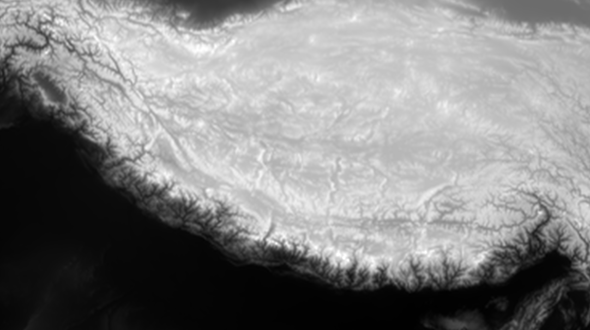
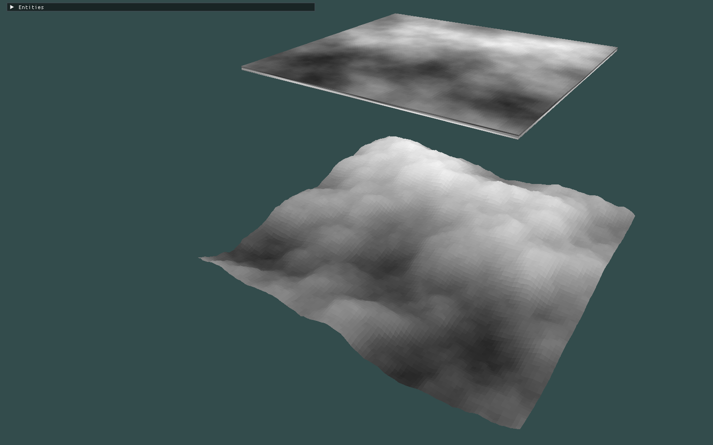


This project was developed using OpenGl with C++ and a number of utility libraries such as glm, stb_perlin, glew, glfw and dearimgui. Links to each can be found at the bottom of this page or on the projects github repo.


## Related
I discuss the use of noise in computer graphics in a separate blog post (which can be found here: [Noise in Graphics](../perlinnoise))

## Introduction
Perlin noise produces pseudo random number values that have a smooth gradient change from one value to another. Unlike white noise which just outputs random values with no regard to what value came before. (See [here](../perlinnoise) for more info)

We generate Perlin noise in one, two or three dimensions. When generating in 2D, we essentially create a grid of noise values.
In graphics, colors can be represented as a combination of values between 0-1. To understand how this can be used to generate terrain in a virtual world, it is first important to understand height fields:

## Height fields
Lets first recap how color can be represented in a computer using rgb values. Using rgb, pure red could be (1.0, 0.0, 0.0) with the first value representing red, and the second two green and blue. In OpenGl the range for each color channel is between 0 - 1, with 0 representing none of that color and 1 represents the full intensity of that color.

If we make all three color channels the same value between 0 and 1, we get various shades of grey. 
For instance (0.2, 0.2, 0.2), would be a very dark shade of grey, but (0.9, 0.9, 0.9) would almost be white.

Now imagine a 2D grid of squares, and let's say each square contains an rgb value in which each each color channel in each square has the same value, but each individual square has a unique value.
In this scenario we have a grid of squares, with each square being a different shade of grey.

This may seem arbitrary at first, but we can use this data structure to represent changes in terrain height. For example take a look at this website: [Planet Earth Height Field](https://tangrams.github.io/heightmapper/).
It depicts a Satellite images of the Earth in grey scale, where the lower the elevation, the darker the image, but the higher the elevation the lighter the image.
If look for large mountain ranges, such as the Andes along the west coast of South America, you will see a vertical strip of light grey and white, indicating that this region has a high elevation.

example image from the linked website:

This grey scale top down image of terrain from above is called a height field (or height map). And it can allow us to render mountainous or hilly terrain incredibly easily (with some restrictions, which I will get into later).

For in depth details on rendering a hight field in computer graphics, refer to my blog post on [OpenGl HeightMap with Phong Shading](../gl-heightmap)

## Creating a Height Field Using Perlin Noise
We can create height fields in multiple ways: e.g. manually using image editing tools such as photo shop, using existing height fields (such as the one from [Planet Earth Height Field](https://tangrams.github.io/heightmapper/)).

Or we can generate one procedurally using algorithms.  
In this case: Perlin Noise. 

For an in depth look at how perlin noise works: ([here](../perlinnoise))

For this project I used [stb_perlin](https://github.com/nothings/stb/blob/master/stb_perlin.h) to generate perlin noise values.

I used the **stb_perlin_noise3** function. It generates 3D perlin noise values, but we can ignore the 3rd dimension to get 2D perlin noise.
We can then use this array to easily generate a height field. 

[ In Development ]

## Tests
Testing reference to unity documentation on Forward Rendering [<a href="#ref1">1</a>\].
Testing reference to youtube video [<a href="#ref2">2</a>\].

## References
1. <a id="ref1"> Unity Technologies, "Forward rendering," Unity Documentation, 2023. [Online]. Available: https://docs.unity3d.com/Manual/RenderTech-ForwardRendering.html. [Accessed: Apr. 22, 2024].</a>
2. <a id="ref2"> Cambridge Computer Science Talks, 2023 "Forward and Deferred Rendering," Online video clip, YouTube, Available: <https://www.youtube.com/watch?v=n5OiqJP2f7w\>. [Accessed on: Apr. 26, 2024].</a>
