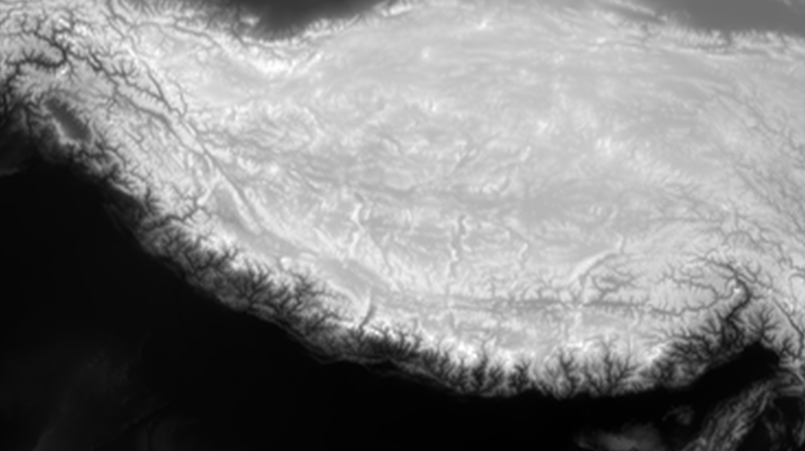


This is christopher winters


## This is a new title
This is my new line

## Related
I discuss the use of noise in computer graphics in a separate blog post (which can be found here: [Noise in Graphics](../../samples/perlinnoise))

## Video of Final Product


## Relaxing Video


## 1. Introduction
Perlin noise produces pseudo random number values that have a smooth gradient change from one value to another. Unlike white noise which just outputs random values with no regard to what value came before. (See [here](../perlinnoise) for more info)

We generate Perlin noise in one, two or three dimensions. When generating in 2D, we essentially create a grid of noise values.
In graphics, colors can be represented as a combination of values between 0-1. To understand how this can be used to generate terrain in a virtual world, it is first important to understand height fields:

## 2. Height fields
Lets first recap how color can be represented in a computer using rgb values. Using rgb, pure red could be (1.0, 0.0, 0.0) with the first value representing red, and the second two green and blue. In OpenGl the range for each color channel is between 0 - 1, with 0 representing none of that color and 1 represents the full intensity of that color.

If we make all three color channels the same value between 0 and 1, we get various shades of grey. 
For instance (0.2, 0.2, 0.2), would be a very dark shade of grey, but (0.9, 0.9, 0.9) would almost be white.

Now imagine a 2D grid of squares, and let's say each square contains an rgb value in which each each color channel in each square has the same value, but each individual square has a unique value.
In this scenario we have a grid of squares, with each square being a different shade of grey.

This may seem arbitrary at first, but we can use this data structure to represent changes in terrain height. For example take a look at this website: [Planet Earth Height Field](https://tangrams.github.io/heightmapper/).
It depicts a Satellite images of the Earth in grey scale, where the lower the elevation, the darker the image, but the higher the elevation the lighter the image.
If look for large mountain ranges, such as the Andes along the west coast of South America, you will see a vertical strip of light grey and white, indicating that this region has a high elevation.

example image from the linked website:


This grey scale top down image of terrain from above is called a height field (or height map). And it can allow us to render mountainous or hilly terrain incredibly easily (with some restrictions, which I will get into later).

For in depth details on rendering a hight field in computer graphics, refer to my blog post on [OpenGl HeightMap with Phong Shading](../gl-heightmap)


## 3. Creating a Height Field Using Perlin Noise
We can create height fields in multiple ways: e.g. manually using image editing tools such as photo shop, using existing height fields (such as the one from [Planet Earth Height Field](https://tangrams.github.io/heightmapper/)).


Or we can generate one procedurally using algorithms. <br/>
In this case: Perlin Noise. 

For an in depth look at how perlin noise works: [go here](../perlinnoise)

For this project I used [stb_perlin](https://github.com/nothings/stb/blob/master/stb_perlin.h) to generate perlin noise values.

Specifically the `stb_perlin_noise3` function. It generates 3D perlin noise values, but we can ignore the 3rd dimension to get 2D perlin noise.
We can then use this array to easily generate a height field. 

Then the **y value** for each vertex of the height field mesh is caculated using the following function to calculate FBM perlin noise (which makes use of `stb_perlin_noise3`) 

```cpp
float FbmNoise2D
(
    float x, 
    float y, 
    unsigned int frequency, 
    int octaves, 
    float lacunarity, 
    float persistence, 
    float amplitude, 
    float maxAmplitude
)
{
	float total = 0.0f;
	float freq = (float)frequency;

	for (int i = 0; i < octaves; ++i) 
	{
        //Use stb_perlin_noise3 function:
		total += stb_perlin_noise3(x * freq, y * freq, 0.0f, 0, 0, 0) * amplitude;

		freq *= lacunarity;
		maxAmplitude += amplitude;
		amplitude *= persistence;
	}

	return total / maxAmplitude; // Normalize output
}
```

In order to create a Perlin Noise Height Field, we first define the width and height of our height field texture, then we call `FgmNoise2D` (width * height) times to find the color (intensity) of each perlin noise value at at each pixel/texel. The following code segment is from my implementation of calculating the valeu for each pixel and storing it in a `std::vector<float>` of noise data.

Then I store the noise data in a texture for sampling using `glTexSubImage2D`.

```cpp
for (int y = 0; y < hfWidth; ++y)
{
	for (int x = 0; x < hfHeight; ++x)
	{
		int index = (y * hfWidth + x) * 4;

		float fx = static_cast<float>(x + SEED) / hfWidth;
		float fy = static_cast<float>(y + SEED) / hfHeight;

		//Normal
		float pnoise = FbmNoise2D(fx, fy, frequency, octaves, lacunarity, persistence, amplitude, maxAmplitude);

		pnoise = (pnoise + 1.0f) / 2.0f;

		noiseData[index] = pnoise;
		noiseData[index + 1] = pnoise;
		noiseData[index + 2] = pnoise;
		noiseData[index + 3] = 1.0f;
	}
}

//Store perlin noise in OpenGL texture.
glTexSubImage2D(GL_TEXTURE_2D, 0, 0, 0, hfWidth, hfHeight, GL_RGBA, GL_FLOAT, noiseData.data());
```

We can then use this texture to render a height field using the method described in my [opengl height map rendering](../gl-heightmap) blog post.

By sampling the noise height map texture as a regular OpenGL texture and displaying it to both a flat quad the height field mesh we should get something that looks like the below image.
(The lighter sections represent a higher elevation, and the darker sections a lower elevation).


To change our height field's appearance we can simply create a SEED value, that acts as an offset for the fx and fy sampling positions, and then change it's value to generate a different looking Height Field. (If you look at the previous code segment, you will see I do just that with a SEED value).

A simple (but highly inefficient) method of seeing this in action, is to increment our seed value by 1 unit every render loop and then recall our code that generated the height field VBO.
I created a function called `resetHF` which does this, and I call it at the end of every render loop.
The downside to this is that you need to recreate your height field and VBO and send it back to the GPU every frame, but since this is just for testing and not intended for any sort of professional project, it should be fine (assuming our height field dimensions are not too big).

## 4. Changing the SEED value every frame

If all works as intended you should get the following effect in your project:
<br>(In the video example I swap between wire frame and regular rendering)



## 5. Decorating the terrain
Honestly, if you are able to do this, and understand how everything works, the rest are mostly fundamental computer graphics techniques all combined together to make a visually interesting scene.

Each probably deserves it's own in depth discussion, but as this post's focus was on using perlin noise to create a landscape I'll only go into each briefly here.
<br><br>
Before we break it down, the final scene  of my procedurally generated world looks like this:

<!-- https://youtu.be/FaSCmcUDz34 -->


## 6. Breakdown of the various elements
This video breaks it down in more detail (it is the same as the one at the top of the page)



## 7. Implementing Grass


The grass was inpired by a youtube video from a creator known as [Acerola](https://www.youtube.com/@Acerola_t), who did a video on how games render fur using shell texturing. In his video, he also demonstrates creating grass via shell texturing, which is an efficient and fairly simple menthod of generating grass.

The video can be found [here](https://www.youtube.com/watch?v=9dr-tRQzij4&t=627s)

## 8. Implementing Clouds


The clouds were probably the part that turned out least like I wanted them to.

I was initially inspired by the clouds from [paradise is coming blog post](https://iquilezles.org/articles/dynclouds/) by **Inigo Quilez**.
In fact, this project overall was inspired by the 64k video submission of [paradise is coming](https://www.youtube.com/watch?v=BUjUf0c7U3I).
I'm not sure what it is, but I find late 1990s and early 2000s 3D graphics really appealing.

My "clouds" were created by generating multiple octaves of perlin noise, that are offset in different directions, and then combined into a final texture image.
This texture image is then rendered onto a skydome object that surrounds the height field mesh landscape, but certain parts that are below a certain brightness threshold are culled (which is what produces the gaps between the clouds the light can shine through).

The image below shows a wireframe image of the skydome object.

.

The cube which acts as my sun is both a directional and a point light, the directional light ignores the skydome object, but the point light illuminates the points it is close to. Hence you get the effect of the clouds being bright and white when the sun in behind them, but darker and more grey when the sun cube is far away.

## 9. Implementing Water


The water was based of a video tutorial series from the YouTuber [ThinMatrix](https://www.youtube.com/@ThinMatrix).
He has a series on water in OpenGL which was very useful as a template for my water system.
The video series can be found [here](https://www.youtube.com/playlist?list=PLRIWtICgwaX23jiqVByUs0bqhnalNTNZh).

I changed the normal map used compared to the one recommended from the video series as my own version looked better with the sun's specular highlights on the water.


## 10. Implementing Sun & Day/Night Cycle

The...

[In development]