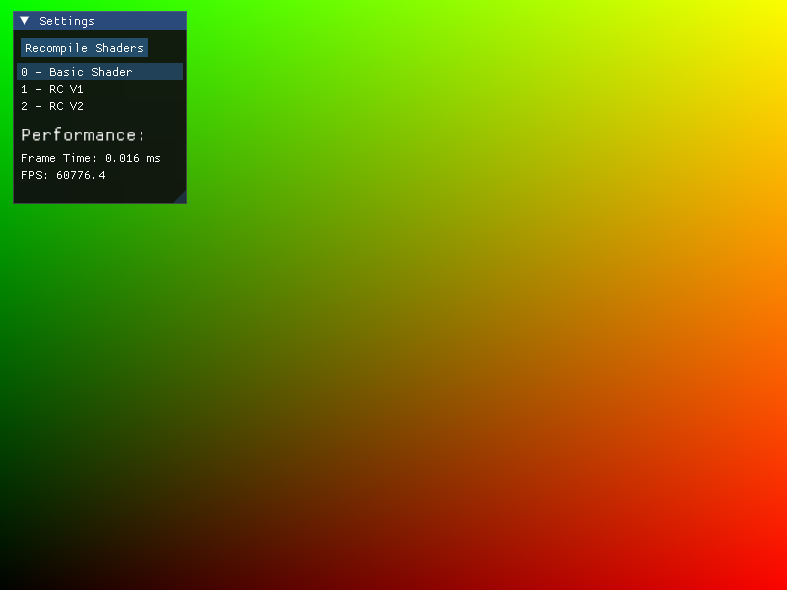
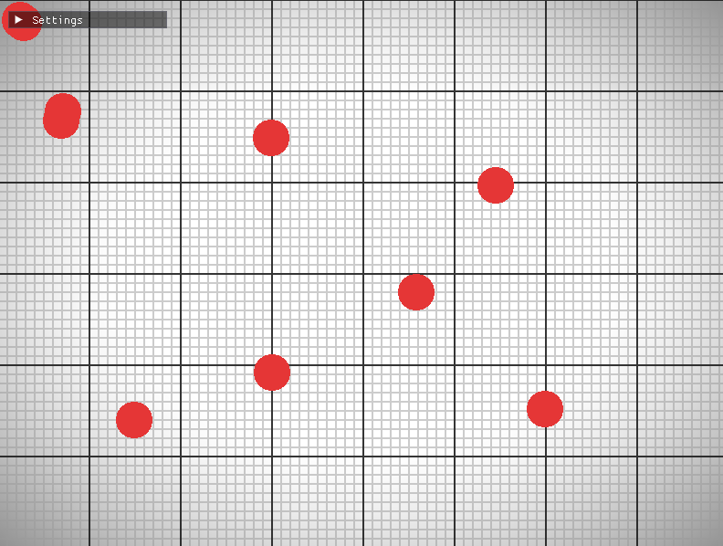
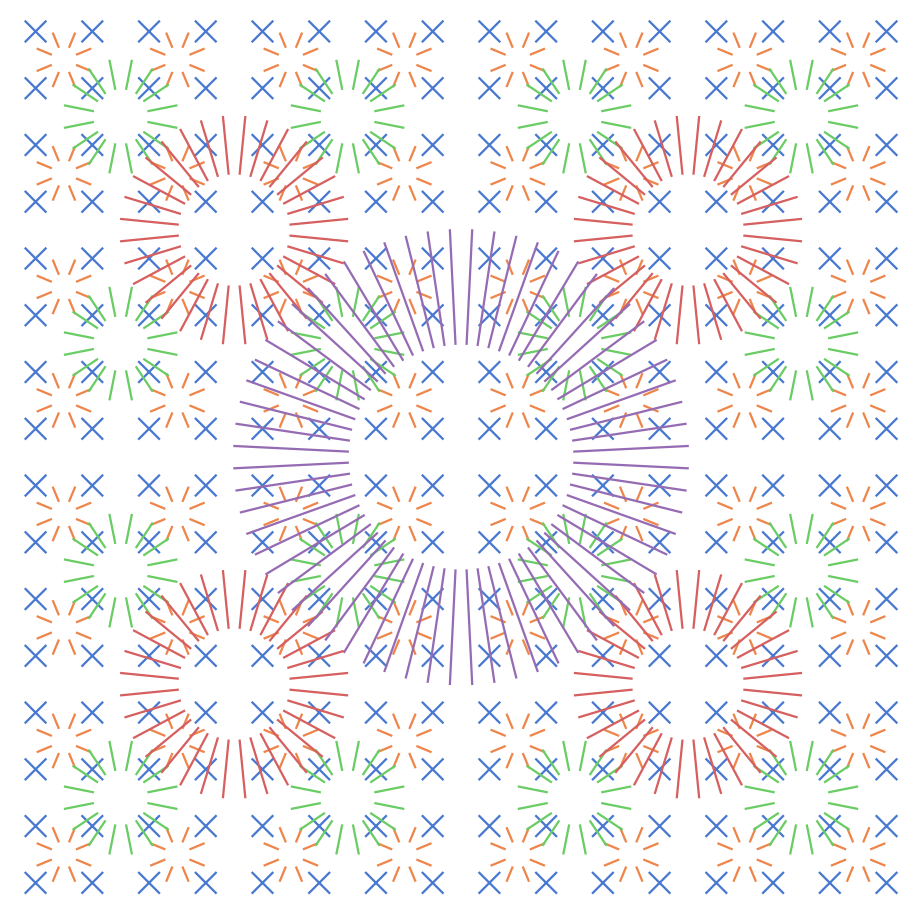
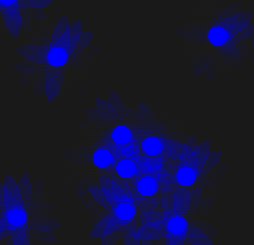
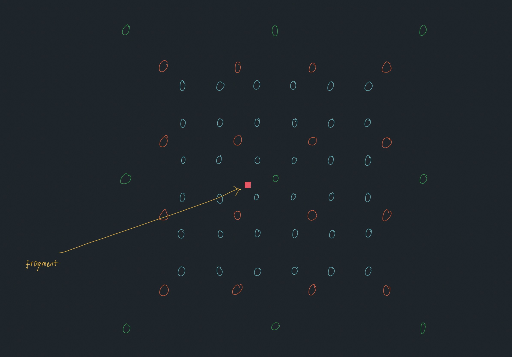
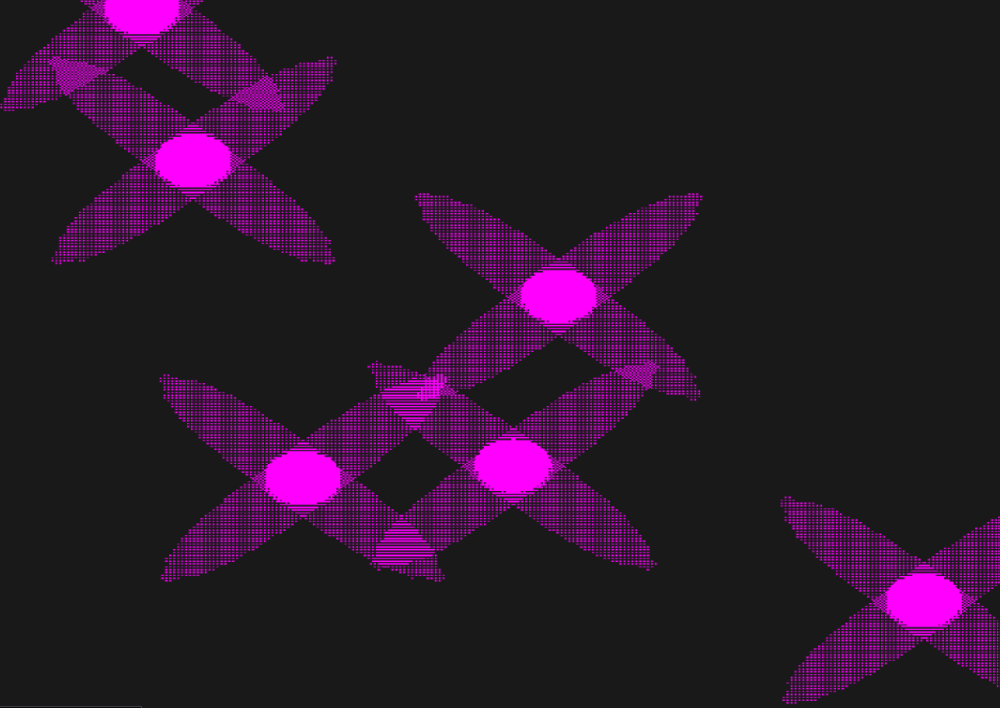
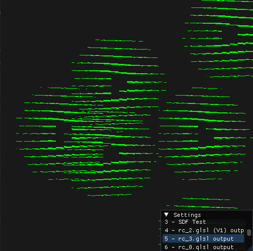
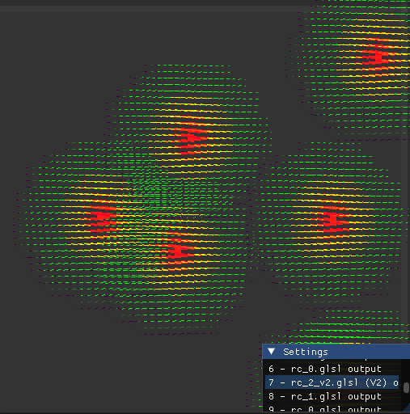
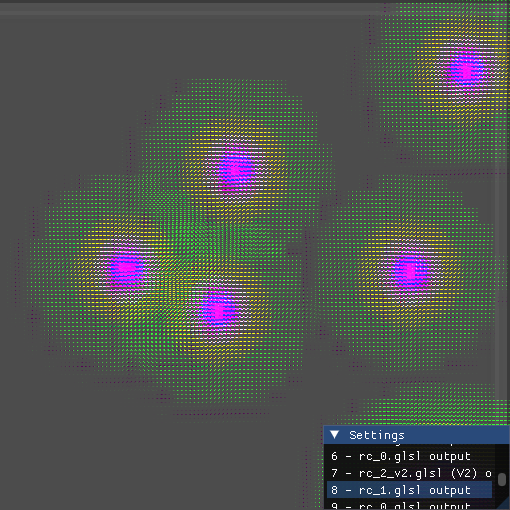
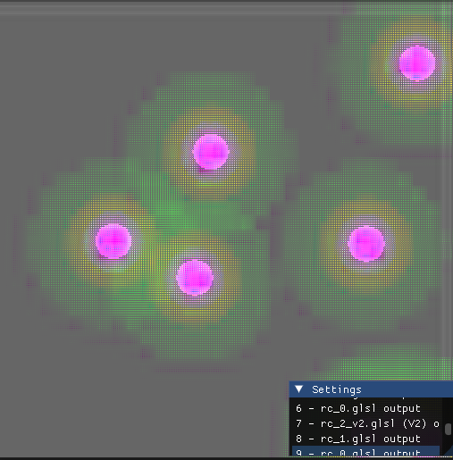

## Try my current version 
[Radiance Cascades Demo](https://izendi.github.io/rc_demo/radiance_cascades_v1_demo.html)

**CONTROLS:** (Right mouse button to draw segments, Left Mouse Button to select menu options.)

**NOTE:** It works but there are issues with it not being sRGB correct, as well as more light leakage and ringing than intended. But it's still cool to mess around with in its current state.

## Introduction

**Link to github code**: https://github.com/Izendi/RC_OpenGL 

Radiance Cascades is a global illumination (GI) technique introduced by Alexander Sannikov from grinding gear games. It has most notably been used in the relatively new video game *Path of Exile 2* to impressive effect.

## Cascade Levels being merged

The top left image was the prototype textures, the levels start from the middle top level and each following image is a lower cascade level texture.


## The Problem Being Solved
Traditional methods of generating accurate global illumination, such as Ray and Path tracing are limited by the high performance cost that grows with the number of rays being cast. At best, with basic ray tracing, increasing the number of rays cast per pixel has a linear growth cost. But when we look into more advanced techniques such as path tracing, which spawn multiple rays per ray surface bounce, we begin to look at exponential computational cost.

Many methods exist to improve path-tracing, such as supporting it via hardware acceleration, only sampling the most important ray bounce direction, or reducing the overall number of rays to create a noisy image and then cleaning it up using generative AI techniques (such as NVIDIA’s DLSS solution).

Despite these methods making real time global illumination more accessible than ever, the fundamental limitation of runaway computational cost is still present and developers are always working around this limitation.

However, **radiance cascades** offers an alternate approach for approximating global illumination. It was inspired by radiance probes, a technique that also aims to approximate global illumination more quickly. Radiance probes work by placing probes around your scene, these probes cast out rays and gather radiance information from the scene. Then each fragment making up your scene, samples from a set of nearby probes to get an approximation of the global illumination. Probes have been used effectively, but the questions such as how many probes to use or how many rays each probe should cast remain and the cost is still growing at least linearly as the number of probes increase.

## How Radiance Cascades Solve This Problem
Radiance cascades attempts to solve these problems in two ways. First by explicitly structuring how probes are placed in the scene and secondly defining hard rules for how many rays are cast for each probe, which is determined by their placement in a hierarchy.

Probes are split into "cascade hierarchies/levels" as Sannikov calls them. The first  level (cascade 0) has the highest number of probes. Let's say n (let's say n = 32), but only casts
x number of rays (for simplicity let's say x = 4). Total number of rays for cascade level 0 is 32 x 4 = 128.
Then cascade level 1 will have n/4 number of probes (32/4 = 8), but each probe will cast 2x ( or 2 x 4 = 8 in this case ) rays. 8 x 8 = 64 total rays.
Then cascade level 2 will have (n/4)/4 number of probes ( (32/4)/4 = 2 ), but each probe will cast 2 x (2x) ( or 2 x (2 x 4) = 16 ) rays. 2 x 16 = 32 total rays.

If we look at the sequence of rays being added with each level: 128, 64, 32. We can see the total number of rays going down with each level.
For each cascade level above the current one, we can bilinearly interpolate between the 4 nearest probes to generate probe data for that lower level cascade. This means we have ray data equal to the sum of the number of rays cast on each level for each level 0 probe.
For instance a single probe on cascade level 0 will have access to it's 4 original rays + 24 from interpolation (8 from level 1 and 16 from level 2). (*MORE REFINED DETAIL NEEDED HERE*)

In the creators own words, it allows "the total cost of calculating these cascades to approach a constant." [<a href="#ref1">1</a>\]
Each level you cast less rays, but through interpolation and averaging each level 0 probe has access to data that represents casting 28 rays of varying lengths.
You can increase the number of probes at the base level or even the number of rays, the total cost will increase, but it will approach and remain a constant.

In general terms, we distribute levels of cascade probes from level 0 up to level n. Each level changes the "resolution" of it's linear and angular component. [<a href="#ref2">2</a>\]
What this basically means is that there are lots of probes laid out at level 0, potentially hundreds or thousands, uniformly laid out in a grid. The lowest layers have lots of probes but very few rays (high linear resolution), as you increase the level of the cascade the linear resolution drops (number of probes), and the angular resolution (number of rays) increases. But since the rays double with every level and the probes decrease by a quarter every level, the total number of rays in each cascade level is half the previous level.

In Sannikov's paper he shows that there is a relationship between this angular and linear resolution using the penumbra effect of a light. [<a href="#ref2">2</a>\]
A video by SimonDev on youtube sums it up nicely (link in reference), he says "There is a relationship how far you are from an object, how big the object is and how closely you need to take samples together." [<a href="#ref3">3</a>\] (*Timestamp* **8:33** *onwards*)
(*MORE DETAIL NEEDED HERE*)

## Intro to my first implementation
I first wanted to implement this using Vulcan, but due to it's high initial learning curce I switched to using OpenGL which I am more familiar with. I will attempt a version using Vulcan at a later date.

Radiance cascades can be complex, especially in 3D, as such, my initial attempt will be a simple 2D implementation using signed distance functions and ray marching.

I first needed to obtain an intuition for how they worked. This was done by reading Sannikov's paper, SimonDev's Youtube video and asking for help on the Radiance Cascades and Graphics Programming Discords. [<a href="#ref1">1</a>\] [<a href="#ref2">2</a>\]

Then I broke the tasks down into 4 main components:

## Task Breakdown

1. Set up a basic opengl test environment in C++, that will allow easy shader creation, runtime recompilation, etc.
2. Use sphere SDFs to define the layout of the scene (for the first attempt the scene will just be made up of circles of various sizes that each can have different light emitting colors).
3. Use Compute shaders to generate the probes and cast rays out from each probe, store the color data collected by each of these rays in a texture file (the texture will be sampled in the final step)
4. Use the data of collected from the probes to compute the lighting information for each fragment on the fullscreen quad. A fragments location on the screen will determine which part of the texture that stores the radiance cascades will be sampled from.

## Step 1: Setting up the environment

For the basic 2D implementation, all I needed was a fullscreen quad to render shader output. 
To facilitate this, I created a new OpenGL template that would allow me to quickly set up, test and cycle through new shaders.
All of which are rendered to the full screen quad. 
I used I'm gui to modify input parameters and added a button to recompile shaders at runtime. 

I also used this chance to create a basic compute shader that draws to a texture and then display the texture on a full screen quad. As I had not used compute shaders before, this gave me the chance to check that I could get them up and running correctly. 

The glsl code for the basic compute shader is:

```glsl
#version 430 core

layout(local_size_x = 16, local_size_y = 16, local_size_z = 1) in;
layout(rgba32f, binding = 0) uniform image2D imgOutput;

void main()
{
    vec4 value = vec4(0.0, 1.0, 0.0, 1.0);
    ivec2 texelCoord = ivec2(gl_GlobalInvocationID.xy);

    value.x = float(texelCoord.x) / (gl_NumWorkGroups.x * gl_WorkGroupSize.x);
    value.y = float(texelCoord.y) / (gl_NumWorkGroups.y * gl_WorkGroupSize.y);

    imageStore(imgOutput, texelCoord, value);
}
```

```cpp
glUseProgram(g_GuiData.cmpShader.m_program_ID);

//Run compute Shader:
glDispatchCompute(32, 32, 1);

//Wait for compute shader to complete:
glMemoryBarrier(GL_SHADER_IMAGE_ACCESS_BARRIER_BIT); 

```

Running the code I get the following output:



Full code can be found in the linked github page by checking out branch: **starting_framework**.

## Step 2: Testing Circle SDF placement using a regular fragment shader

With the basic setup in place and a working example compute shader I now needed some mechanism to create a 2D scene that I could represent using radiance cascades. 
To keep it simple, I decided to limit my 2D scene to only be made up of circles.

This serves multiple purposes:

1. First, I can define my scene using circle signed distance functions. If I want every radiance cascade probe to cast a ray into the scene and check for intersections, a very easy way to do this is to have each probe ray march (instead of ray trace) its rays and use SDFs (Signed Distance Functions) to get our marching distance and check for circle intersections. This is means I simply need to store a list of sphere locations and their radius, then pass that to my fragment shader for rendering. 
2. Keeping the scene strucutre simple helps focus on the main technique, the Radiance Cascades, without spending to much time implementing more complex scene setups, especially for any kind of ray casting system, where intersection testing for basic shapes is simple, but becomes vastly more expensive as the shape being intersection tested against becomes more complex.

I wanted a sphere to appear anywhere on the screen that I click.

To achieve this, I used **glfw** to capture my mouse location during a mouse click using the functions `glfwSetCursorPosCallback` and `glfwSetMouseButtonCallback`.
I then stored the position of my mouse (it's x and y coordinates in the OpenGL window) in two C-style arrays `mouseXpos[500]` and `mouseYpos[500]`, limiting the size to 500 each to avoid going over the Max Fragment Uniform Components size which is around 1024 ~ 4096 depending on your GPU hardware. (**NOTE**: *Ideally I should use something without such extreme size limits, like a Shader Storage Buffer Object, Texture Buffer, etc. but for initial testing, this should do the job*).

Then I send this data every frame, along with an index uniform of the latest array element, to the fragment shader. The fragment shader then loops over every sphere position and generats an SDF for each, which is rendered to the screen.

The **glsl** code is as follows (much of this code was taken from or inspired by the simon dev's course on shader programming which can be found [here](https://simondev.io/courses)) [<a href="#ref4">4</a>\]

```
#version 430 core

in vec2 texCoord;

out vec4 FragColor;

uniform vec4 ourColor;
uniform sampler2D u_tex_0;

uniform float mouseX[500];
uniform float mouseY[500];

uniform int mouseIndex;

vec3 BLACK = vec3(0.0, 0.0, 0.0);
vec3 WHITE = vec3(1.0, 1.0, 1.0);
vec3 GREY = vec3(0.6, 0.6, 0.6);

vec3 RED = vec3(0.9, 0.21, 0.21);

float inverseLerp(float v, float minValue, float maxValue) 
{
    return (v - minValue) / (maxValue - minValue);
}

float remap(float v, float inMin, float inMax, float outMin, float outMax) 
{
    float t = inverseLerp(v, inMin, inMax);
    return mix(outMin, outMax, t);
}

vec3 BackgroundColor()
{
    float distFromCenter = length(abs(texCoord - 0.5));

    float vignette = 1.0 - distFromCenter;

    vignette = smoothstep(0.0, 0.7, vignette);
    vignette = remap(vignette, 0.0, 1.0, 0.3, 1.0);

    return vec3(vignette);
}

vec3 drawGrid(vec3 color, vec3 lineColor, float cellSpacing, float lineWidth)
{
    vec2 resolution = vec2(800, 600);
    vec2 center = texCoord - 0.5;
    vec2 cells = abs(fract(center * resolution / cellSpacing) - 0.5);
    float distToEdge = (0.5 - max(cells.x, cells.y)) * cellSpacing;
    float lines = smoothstep(0.0, lineWidth, distToEdge);

    color = mix(lineColor, color, lines);

    return color;
}

float sdfCircle(vec2 fragPos, float r, float offset_y, float offset_x)
{
    fragPos.x = fragPos.x + offset_x;
    fragPos.y = fragPos.y + offset_y;
    return length(fragPos) - r;
}

void main()
{

    vec2 pixelCoords = (texCoord) * vec2(800, 600);

    float x = step((abs(mod(texCoord.x, 0.025))), 0.004); // if value is less than 0.004 return 1
    float y = step((abs(mod(texCoord.y, 0.025))), 0.004);

    float isBlack = max(x, y);

    vec4 black = vec4(BLACK, 1.0);
    vec4 white = vec4(WHITE, 1.0);

    vec3 finalColor = BackgroundColor();
    finalColor = drawGrid(finalColor, GREY, 10.0, 1.0);
    finalColor = drawGrid(finalColor, BLACK, 100.0, 1.5);

    for (int i = 0; i < mouseIndex; i++)
    {
        d = sdfCircle(pixelCoords, 20.0, -mouseY[i] * 600.0, -mouseX[i] * 800.0);
        finalColor = mix(RED, finalColor, step(0.0, d));
    }

    FragColor = vec4(finalColor, 1.0);
}
```

Clicking a few places on the screen yields the following result:


Now that we can place sdf circles, we can move on to having our probes cast rays into the scene, check for intersections with the circles and store the result in a texture which will be used to calculate the radiance (Described in detail in the next section).

## Step 3: Defining the probes and how they will store radiance data

In Radiance Cascades (RC) we have different levels of probes. Looking at the paper from Alexander Sannikov. [<a href="#ref2">2</a>\]
We can see the following diagram (**figure 4** in the paper) describing how each probe level casts its rays:




The blue lines are cast from the level 0 RC probes, Orange from level 1, Green from Level 2, Red from level 3 and Purple from level 4. This is what I was referring to earlier about each level changing the linear and angular resolution. As we go up each level the number of probes decreases but the length of the rays and the number of rays increases. 

The question now is how do we store the data collected from each probe in a manner that can be easily sampled by a shader?

My solution was to store each cascade levels total data in an individual texture. My goal was to create a compute shader for each cascade hierarchy that casts the rays for each probe and stores the collected data in the relvant texture location. 
Then when I render my scene each fragment can check it's location relative to the texture data layout to determine which need to be sampled and have their data merged to calculate the final radiance for that fragment. 
Don't worry about the merging process for now though, the current problem being solved is how do we store the data from each ray being cast in a format that can be easily accessed by OpenGL glsl shaders. 

The sketch below should clarify my description (the arrowheads color corresponds to the texture grid position that will hold the data):


Firstly the level 0 compute shader, each probe will use four texels in the output texture to store its results. 

**[to be continued...]**

## Testing the RC level 1 texture output



## Merging Cascades (First attempt)

A problem I encountered was how to merge the cascades.

Originally, I planned to store the probe data from each cascade level completely separately with a texture for each cascade level. Then I planned to have the fragment shader march up through each level and sample the corresponding
probe data at each level. 

However, it soon became apparent that this would be highly computationally expensive. 

Let's use the following example to explain why this method is infeasible.
In the image below, the red square marks the current fragment, with blue circles being level 0 probes, orange being level 1 probes and green being level 2 probes. (realistically all probes would cover roughly the same area and the level 0 probes would extend out to where the green level 2 probes are, but for the sake of the example, this number will suffice).




First the red probe would need to find the 4 nearest level 0 probes:


Then each of the four nearest level 0 probes would need to find the four nearest level 1 probes and bilinearly interpolate between them to find the color value to merge with the current probes color value:


Then each of the cascade level 1 probes (siz in this example), would need to find their four nearest cascade level 2 probes:


In this example first we use 4 probes from level 0, then 6 probes from level 1 then 8 probes from level 2 (linear probe growth). Using this approach, each instantiation of the fragment shader will need to sample at least 18 probes and determine which to sample relative to the previous level's probe positions.
That's a lot of work for the fragment shader. It was certain I was missing something and upon further investigation, found the correct approach (described in the next section).

## Merging Cascades (Second attempt)

After realizing the failings of my first method, I consulted with other members of the Radiance Cascades online community, and realized that storing each cascade level's lighting information in isolated textures was unnecessary.

Each fragment, needs to find the 4 nearest level 0 probes and perform bilinear interpolation between them to get the lighting information from each of the four quadrants. From there we need to find the four nearest level N+1 probes and merge the values with the level N rays using bilinear interpolation.
I was repeating this for each individual fragment, but it's important to remember that the probes never move, only the fragments, that means we can pre-compute the ligting information for all probes in cascade levels higher than level 0.

Instead of starting at level 0 and working up, we can instead start at the top level K. Then once we have calculated all of K's probe lighting information and stored it in a texture file. We can move on to level K-1.

Here, every time we compute a ray's color value, we can find it's corresponding branched rays in the 4 nearest K level probes, perform bilinear interpolation on the four probes relevant rays with the weight being the current K-1 level probe's position.
Then we can merge this bilinearly interpolated color value with the K-1 probes ray being calculated.
By doing this, the texture file associated with cascade level K-1 will contain the combined color data from cascade level K and cascade level K-1. If we repeat this process for cascade level K-2 and do bilinear interpolation and merging with cascade level K-1.
Then cascade level K-2 will contain K-1's and K's cascade level color data.
**If we repeat this until we get to level 0, then level 0's texture file will contain the merged color data for all the cascade levels, meaning our fragment shader only needs to locate the 4 nearest level 0 probes, and bilinearly interpolate between them to get the final color value for that fragment.**

**[to be continued...]**

## References
1. <a id="ref1"> Alexander Sannikov, "ExileCon 2023 - Rendering Path of Exile 2," YouTube, Jul. 29, 2023. [Online]. Available: https://www.youtube.com/watch?v=TrHHTQqmAaM&t=2037s. [Accessed: Jan. 14, 2025].</a>
2. <a id="ref2"> C. M. J. Osborne and A. Sannikov, "Radiance Cascades: A Novel High-Resolution Formal Solution for Multidimensional Non-LTE Radiative Transfer," arXiv, Aug. 2024. [Online]. Available: https://arxiv.org/pdf/2408.14425v1. [Accessed: Jan. 14, 2025].</a>
3. <a id="ref3"> SimonDev. "Exploring a New Approach to Realistic Lighting: Radiance Cascades" [Online Video]. Available: [URL](https://www.youtube.com/watch?v=3so7xdZHKxw). Accessed: January 14, 2025.</a>
4. <a id="ref4"> SimonDev. "Featured Courses" [Web Page]. Available: [URL](https://simondev.io/courses). Accessed: February 15, 2025</a>


## Images












