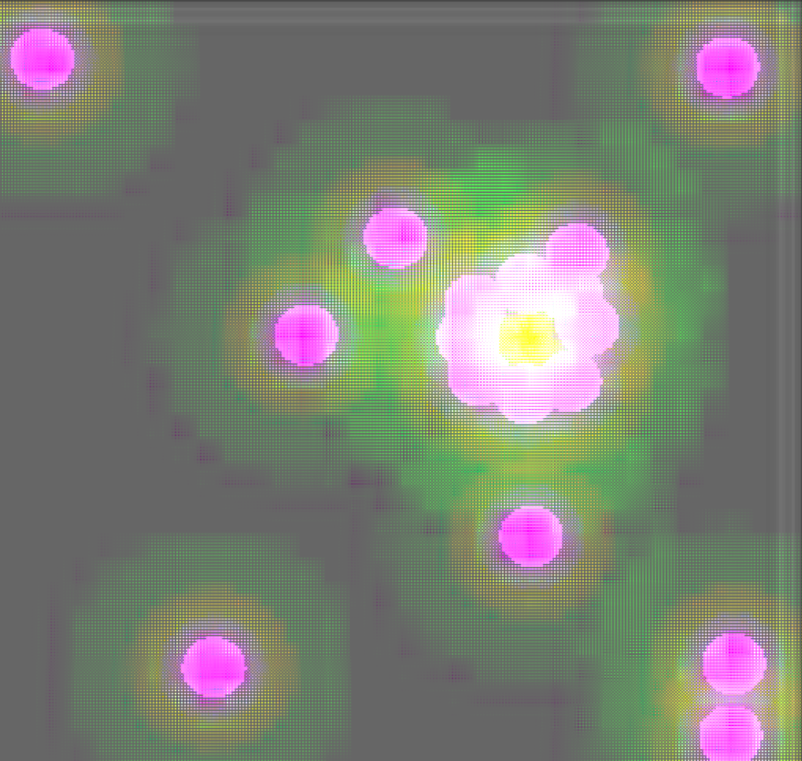

## Try my current version 
[Radiance Cascades Demo](https://izendi.github.io/rc_demo/radiance_cascades_v1_demo.html)

**CONTROLS:** (Hold the right mouse button to draw segments, Use the Left mouse button to select menu options.)

**NOTE:** Slider next to the scene select is to change the thickness of segments. You can change segment colors with the color picker. 

## Introduction

**Link to github code**: [https://github.com/Izendi/radiance_cascades_V2](https://github.com/Izendi/radiance_cascades_V2)

Radiance Cascades is a global illumination (GI) technique introduced by Alexander Sannikov from grinding gear games. It has most notably been used in the relatively new video game *Path of Exile 2* to impressive effect.

## Cascade Levels being merged

The images below shows each cascade level being merged into the final image. (With top left being Cascade 4, then going left to right, cascade 3, cascade 2, cascade 1, cascade 0 and the final image in the bottom right)

## Example Scenes

## The Problem Being Solved
Radiance cascades aims to be a real time solution to the **spatial frequency problem** in global illumination.

Spatial frequency is how quickly a signal (lighting in this case) changes over space.

**High spatial frequency** is when lighting changes fast over a short distance.

**Low spatial frequency** is when lighting changes slowly and smoothly over large areas.

Look at the image below taken from Alexander Sannikov's radiance cascade paper. We have a light source casing light downwards being partially occluded by a horizontal segment. This creates a penumbra (an area not completly in shadow that is partially lit).
We can see that if we sample along segment A, the lighting changes very quickly as we move through space. But, if we sample along segment B, the lighting changes slowly as we move through space.

The main takeaway from this is that the lighting contribution from far away objects changes slowly as we move though space but the contribution from nearby objects changes rapidly as we move through space.

Additionally, let's think about this in terms of lighting probes that cast out rays.
If a probe is nearby an object, many of it's rays have a very high chance of colliding with the object. But as we move further away from the object, fewer rays will collide with the object. (See the two images below for an example).

We can use these **two rules**:

- **RULE 1**: lighting contribution from far away objects changes slowly as we move though space but the contribution from nearby objects changes rapidly as we move through space.

- **RULE 2**: Probes nearby object have a high ray collision chance but as they move further away that collision chance drops.

To form the basis for radiance cascades.

## The Radiance Cascades Implementation

Using **RULE 1** and **RULE 2** we can define a specific probe layout to take advantage of these rules.

This probe layout is the foundation of radiance cascades.

As we move away from object, we need more rays to capture their lighting contribution but we can worry less about the spacing of those probes, that is to say, a probe far away from a light probe can be shifted around with minimal changes to the total light gather by the probe, but a probe nearby the light with rapidly change the light being gathered with small movements through space.

This is where radiance cascades uses the idea of probe hierarchies, also called cascade hierarchies.

Cascade 0, is made up of many probes very close together, but each probe only casts a small number of rays (maybe 4 rays, in the top right, top left, bottom left and bottom right directions).
The rays can't travel very far from their probe and they are intended to gather nearby lighting data.
Above cascade 0 we have cascade level 1. This cascade level has fewer probes than cascade level 0, with each probe being space further apart from each other, but each probe casts more rays. (maybe 16 rays, 4 in each top right, top left, and bottom left and bottom right directions).

This pattern continues until the highest cascade which has the fewest probes (with large distances between the probes), but each probe casts a large number of rays very far into the scene and the rays start position is offset greatly from the probes center.

The diagram below explains the idea:

In general terms, we distribute levels of cascade probes from level 0 up to level n. Each level changes the "resolution" of it's linear and angular component. [<a href="#ref2">2</a>\]
What this basically means is that there are lots of probes laid out at level 0, potentially hundreds or thousands, uniformly laid out in a grid. The lowest layers have lots of probes but very few rays (high linear resolution), as you increase the level of the cascade the linear resolution drops (number of probes), and the angular resolution (number of rays) increases. But since the rays double with every level and the probes decrease by a quarter every level, the total number of rays in each cascade level is half the previous level.

## References
1. <a id="ref1"> Alexander Sannikov, "ExileCon 2023 - Rendering Path of Exile 2," YouTube, Jul. 29, 2023. [Online]. Available: https://www.youtube.com/watch?v=TrHHTQqmAaM&t=2037s. [Accessed: Jan. 14, 2025].</a>
2. <a id="ref2"> C. M. J. Osborne and A. Sannikov, "Radiance Cascades: A Novel High-Resolution Formal Solution for Multidimensional Non-LTE Radiative Transfer," arXiv, Aug. 2024. [Online]. Available: https://arxiv.org/pdf/2408.14425v1. [Accessed: Jan. 14, 2025].</a>
3. <a id="ref3"> SimonDev. "Exploring a New Approach to Realistic Lighting: Radiance Cascades" [Online Video]. Available: [URL](https://www.youtube.com/watch?v=3so7xdZHKxw). Accessed: January 14, 2025.</a>
4. <a id="ref4"> SimonDev. "Featured Courses" [Web Page]. Available: [URL](https://simondev.io/courses). Accessed: February 15, 2025</a>

## Images

