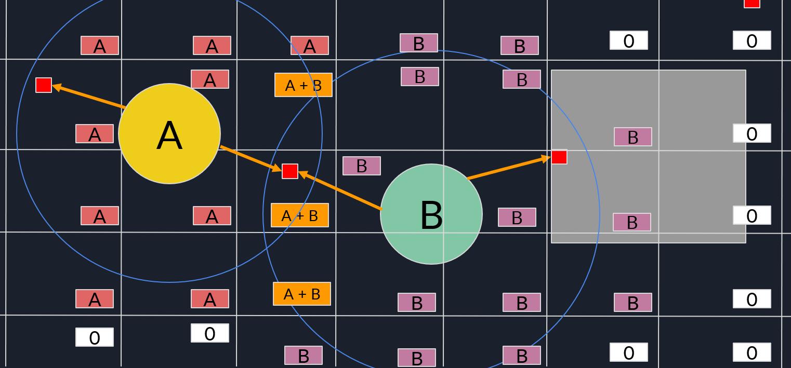


A paper that can be found at: https://www.cse.chalmers.se/~uffe/tiled_shading_preprint.pdf


## Overview

## Labeled Diagram

[ In development ]   

## Related Topics
Deferred shading was mainly created as a means of increasing the number of lights that could be in a scene while maintaining reasonable real-time performance metrics. [<a href="#ref3">3</a>\]
This technique was later built upon using [Tiled Shading](../tiledshading).

## References
1. <a id="ref1"> Unity Technologies, "Forward rendering," Unity Documentation, 2023. [Online]. Available: https://docs.unity3d.com/Manual/RenderTech-ForwardRendering.html. [Accessed: Apr. 22, 2024].</a>
2. <a id="ref2"> Cambridge Computer Science Talks, 2021 "Forward and Deferred Rendering," Online video clip, YouTube, Available: <https://www.youtube.com/watch?v=n5OiqJP2f7w\>. [Accessed on: Apr. 26, 2024].</a>
3. <a id="ref3"> Wikipedia, "Deferred shading," Wikipedia: The Free Encyclopedia. Available: https://en.wikipedia.org/wiki/Deferred_shading. [Accessed: Sep. 6, 2024].</a>
4. "What are the advantages and disadvantages of using deferred rendering?" LinkedIn. [Online]. Available: https://www.linkedin.com/advice/1/what-advantages-disadvantages-using-deferred-rendering#:~:text=Deferred%20rendering%20has%20its%20drawbacks,being%20compatible%20with%20some%20platforms. [Accessed: Sep. 6, 2024].</a>

