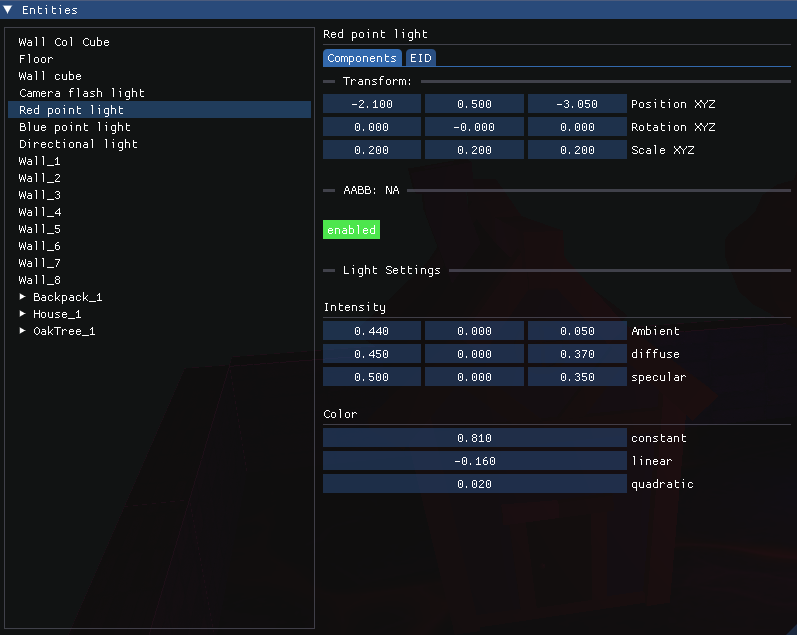


A paper that can be found at: https://www.cse.chalmers.se/~uffe/tiled_shading_preprint.pdf


## Overview

Looks pretty cool huh   

Image of the GUI that can be used to manipulate the scene.

## Step 1

Best of all it's shiny!

