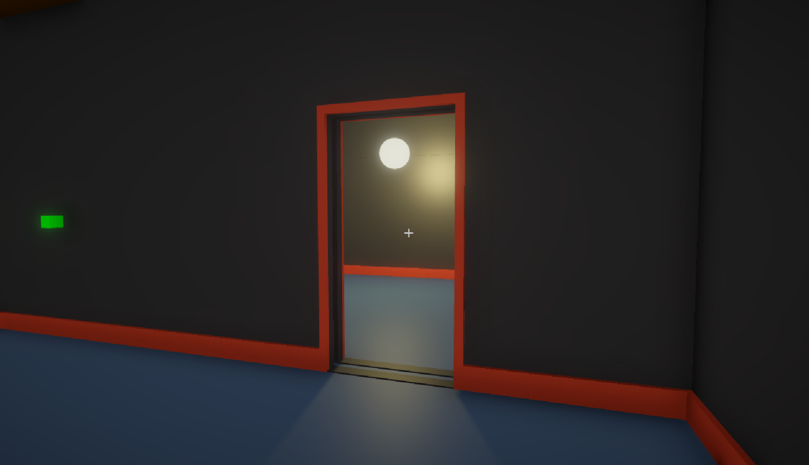


Github link to project, witch also lists my group members as collaborators: https://github.com/Izendi/UrbanMyth


## Overview
[**This page is still in development**]

This is a small scale game myself and a group of 4 other people worked on for a university project.

## Setting
Our group decided to set the game in an abandoned apartment block. This would allow us to build a intricate play area without needing to concern ourselves with the often higher complexity of natural environments.
By making it abandoned, we could reduce the amount of furniture and go for the liminal space approach that has become highly popular in recent psychological horror indie projects.
Overall, it offers a believable play area that is highly scaleable depending on time constraints or hurdles encountered during development.

## Pipeline
The Unity URP (Universal Render Pipeline) [<a href="#ref1">1</a>\] [<a href="#ref2">2</a>\] allows a fair amount of customization without being overly demanding on the hardware.
As such, it seemed like the best choice for a small scale beginner project.

## Setting the Scene
I wanted the game to have a dark dream like atmosphere.
I thought I would start simple and add complexity to my scene one stage at a time.

To begin I created a basic outline of what a section of the apartment block would look like.
This was the small storage room (the starting room) and a larger room that connects to the central staircase. The storage room and large central room are joined by a pipe the player can crawl through and a door that can be slid open.

[**To be continued**]

## Menu System
The menu...

## References
1. <a id="ref1"> Unity Technologies, "Universal Render Pipeline (URP)" Unity official website, 2024. [Online]. Available: https://unity.com/srp/universal-render-pipeline. [Accessed: Oct. 4, 2024].</a>
2. <a id="ref2"> Unity Manual, 2024 "Introduction to the Universal Render Pipeline," Documentation, Available: <https://docs.unity3d.com/6000.0/Documentation/Manual/urp/urp-introduction.html>. [Accessed on: Oct. 4, 2024].</a>
3. <a id="ref3">T. Akenine-Möller, E. Haines, and N. Hoffman, *Real-Time Rendering*, 4th ed. Boca Raton, FL: CRC Press, 2018.</a>

